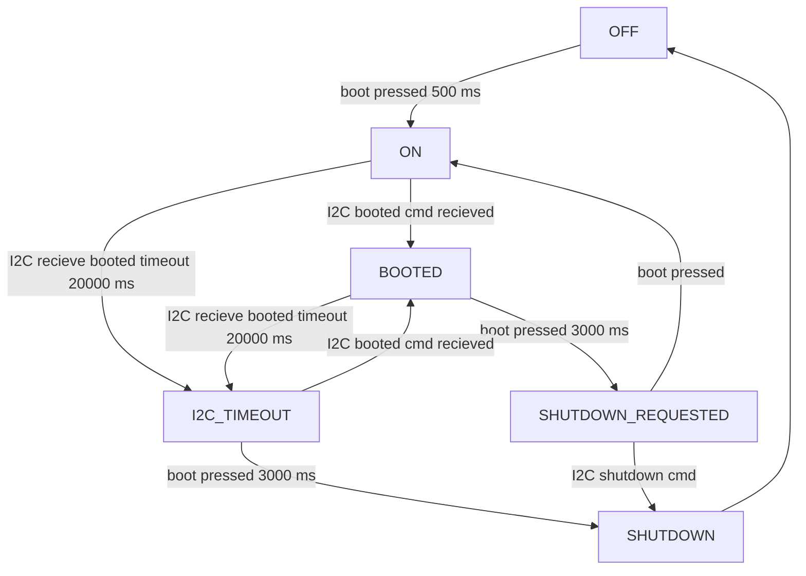
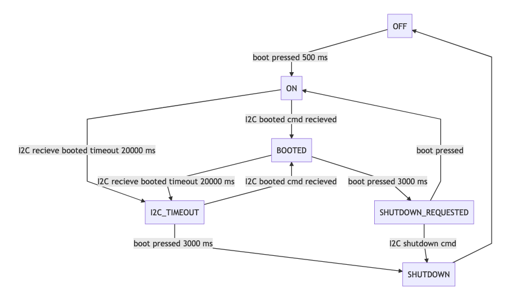

```bash
        __        _______    ____  ____   ___
        \ \      / /_   _|  |___ \|___ \ / _ \
         \ \ /\ / /  | |_____ __) | __) | | | |
          \ V  V /   | |_____/ __/ / __/| |_| |
           \_/\_/    |_|    |_____|_____|\___/
       --- JBR Engineering Research Ltd 2019 ---
```

Design files, firmware and linux scripts for my _clever_ serial terminal, the
Whitterm-220 - WT-220. 

The WT-220 is a homage to the VT-220, providing a physical RS232 terminal with
the full features of a Linux computer running on a Raspberry Pi.

## Raspberry Pi Hat (./whitterm-hat)

KiCad design files for the rear io-panel:

* USB-C input for USB-PD high current (3 A) supply to RPi. LEDs indicate
  detected current profile from UFP. I2C lines made available to SAMD for
  playing with USB-C device modes.
* MAX3232 RS232 transceiver provides RS232 level interface to RPi UART and SAMD
  UART.
* SAMD21 microcontroller provides boot button control of RPi over I2C and
  buffered IO. Can be programmed over USB-C CDC-serial device or ISP.
* Control of RPi power supply from SAMD. Off by default allows safe start up, only when power input suitable/ready.
* DIP switch control of device UART connections (SAMD, RPi, RS232).
* Board replaces laser cut acrylic back piece from original design - it is
  both electronically and mechanically integrated.
* Lots of status LEDs 😃.

**There where a few green wires required for the first production (1.0). I
rolled these changes into the schematic but not fully updated the PCB.**

## Firmware (./firmware)

Arduino compatible firmware for rear panel SAMD21. Acts as I2C slave and
controls supply to RPi via 'Boot' button:

### Simplified State Diagram





## RPi Files (./rpi)

I started from a base Raspbian Lite image rather than Arch for this build.
Raspbian Lite is nice because I could install only what I wanted/needed. I
opted for I3WM since it's a keyboard terminal.

### Services

* boot: Runs shell script that displays boot ascii logo.
* i2c: Runs python I2C script (wt220-i2c.py) that configures case LEDs to act
  on RX/TX and then maintains link with I2C link with SAMD. Polls shutdown
  request state and acts on request by issuing system shutdown.
* poweroff: Runs on 'shutdown.target' and issues the final I2C shutdown
  command so that SAMD disables RPi 5 V.

### Config Files

Would make an install script for this if I was making more...

* xinitrc -> /etc/X11/xinit/xinitrc
* config.txt, cmdline.txt -> /boot/
* Xresources -> ~/.Xresources
* motd -> /etc/motd
* wt220-sshbanner.net -> /etc/wt220-sshbanner.net `Banner /etc/wt220-sshbanner.net` in
  /etc/ssh/sshd_config
* \*services. -> /lib/systemd/system/
* scripts -> /opt/wt220/

### Packages

Need to manually install
[`cool-retro-term`](https://github.com/Swordfish90/cool-retro-term)

Other packages in 'rpi/dpkg-selections.txt'

## Breakout (./whitterm-breakout)

DB9 GPIO breakout from V 1.0 rear panel
